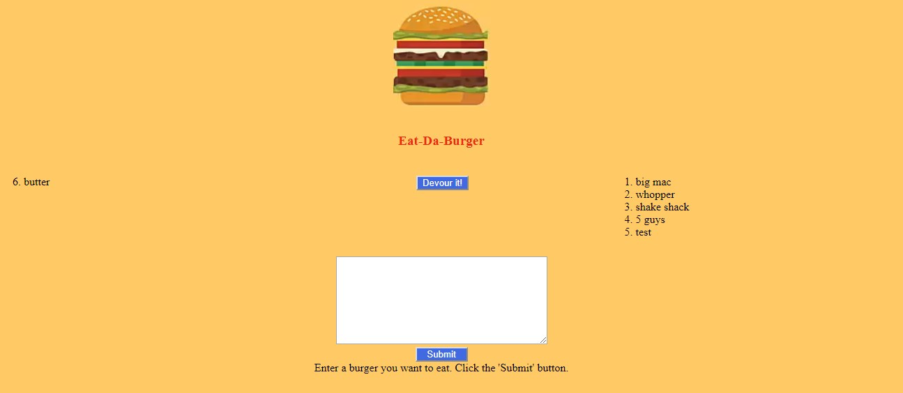

# Homework-Node Express Handlebars

  

## Table of contents
* [General info](#general-info)  
* [User Story](#user-story)  
* [Instruction](#instructions)  
* [Business Context](#business-context)  
* [Screenshots](#screenshots)  

## General info
In this assignment, you'll create a burger logger with MySQL, Node, Express, and  Handlebars. Use MySQL to query, the server to route data in your app, and Handlebars to generate your HTML.

## User Story
AS A developer learning Node Express Handlebars, 
I WANT to be able to demonstrate new knowledge using handlebars and deploying an app with a database to Heroku
SO THAT I can take the next step in showcasing my skills

## Instructions  
Eat-Da-Burger! is a restaurant app that lets users input the names of burgers they'd like to eat. Whenever a user submits a burger's name, your app will display the burger on the left side of the page -- waiting to be devoured. Each burger in the waiting area also has a Devour it! button. When the user clicks it, the burger will move to the right side of the page.

Your app will store every burger in a database, whether devoured or not.  

[Link to deployed app](https://fathomless-basin-48623.herokuapp.com/) 
(Click to open app)

GitHub Repo:    https://github.com/cbush2014/burger    
Portfolio Page:   https://cbush2014.github.io/

## Screenshots
  

